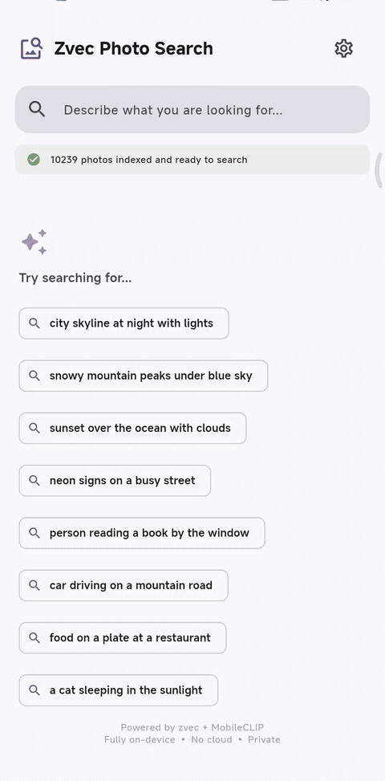

<div align="center">

# PocketSearch

**Describe it. Find it. On your phone, offline.**

*A unified, on-device search layer for personal data — starting with photos.*

[](LICENSE)
[]()
[]()
[](https://github.com/alibaba/zvec)

[English](README.md) · [中文](README_zh.md)



</div>

---

PocketSearch lets you find photos on your phone by *describing them*, without manual album organization or a cloud round-trip. Powered by [Zvec](https://github.com/alibaba/zvec) and its [Dart/Flutter SDK](https://github.com/zvec-ai/zvec-dart), plus [MobileCLIP-S1](https://github.com/apple/ml-mobileclip) running locally via [MNN](https://github.com/alibaba/MNN).

## 🎯 Vision

Personal data on a phone is fragmented across photos, notes, mail, messages, files and third-party apps — and most of it is too sensitive to leave the device. As mobile AI assistants get more capable, they need a **local retrieval layer** they can query without round-tripping to the cloud.

PocketSearch is our take on that layer. The product principle is simple:

- **Local-first.** Index, embed, retrieve and rank — all on the device. No upload, no socket calls in the default path.
- **Multi-source.** Photos today; notes, mail, files, screenshots / OCR, third-party app data next.
- **Dual-purpose.** A search box for humans, and a structured retrieval API for on-device agents.

We started with **photos** because the gallery is the largest, fastest-growing personal corpus on most phones — screenshots, receipts, whiteboards, chat captures — and users rarely remember filenames or dates, only *what was in the picture*.

## ⚡ Quick Start

> **Prerequisites**: Flutter ≥ 3.41, Xcode 15+ (iOS only), Android SDK (Android only).
> Model conversion from source also needs `uv`.

### Common setup (both platforms)

```bash
git clone git@gitlab.alibaba-inc.com:xufeihong.xfh/PocketSearch.git
cd PocketSearch
flutter pub get
bash scripts/prepare_mnn_src.sh      # Download MNN source (~89 MB, cached in ~/.cache/)
bash scripts/check_models.sh         # Verify required MobileCLIP .mnn assets
```

If `check_models.sh` reports missing model files, complete [Model Preparation](#model-preparation) before building.
Flutter builds also reference these model files explicitly, so missing models fail at build time instead of producing an APK/IPA that cannot start.

### Android

```bash
flutter build apk --release
flutter install --release -d <ANDROID_DEVICE_ID>
```

Alternatively, install the generated APK with `adb`:

```bash
export PATH="$HOME/Library/Android/sdk/platform-tools:$PATH"   # macOS default Android SDK path
adb install build/app/outputs/flutter-apk/app-release.apk
```

That's it. Open the app, grant photo permission, done.

### iOS

The generated Xcode project/workspace is intentionally not committed. Create it locally first:

```bash
flutter create --platforms=ios --org app --project-name pocketsearch .
cd ios && LANG=en_US.UTF-8 LC_ALL=en_US.UTF-8 pod install && cd ..
```

Then:

1. Open Xcode and add your Apple ID: **Xcode → Settings → Accounts → "+"**
2. Open the generated workspace and configure signing:
   ```bash
   open ios/Runner.xcworkspace
   ```
   In Xcode: **Runner project → Signing & Capabilities → Team → select your account**
3. Connect your iPhone, select it as target, and press **▶ Run**.
4. First launch on device: go to **Settings → General → VPN & Device Management** → trust the developer certificate.

> After the first Xcode build, you can also use `LANG=en_US.UTF-8 LC_ALL=en_US.UTF-8 flutter run -d <DEVICE_ID> --release` for subsequent runs.
> Find your device ID: `xcrun xctrace list devices`

### Model Preparation (only if models are missing)

Model binaries are large and intentionally not committed to git. PocketSearch needs these two files before it can run:

```text
assets/models/mobileclip_s1_image_encoder.mnn
assets/models/mobileclip_s1_text_encoder.mnn
```

If your distribution provides pre-converted release assets, download them into `assets/models/`. Otherwise, re-export from MobileCLIP-S1. The commands below use `uv`; install it first if needed (`curl -LsSf https://astral.sh/uv/install.sh | sh`). Add or change the `--index-url` mirror if your network is slow.

```bash
curl -L -o /tmp/mobileclip_s1.pt \
  https://docs-assets.developer.apple.com/ml-research/datasets/mobileclip/mobileclip_s1.pt
python3 -m venv .venv
uv pip install --python .venv/bin/python \
  --index-url https://pypi.tuna.tsinghua.edu.cn/simple \
  torch torchvision timm open-clip-torch onnx onnxruntime MNN
uv pip install --python .venv/bin/python --no-deps \
  "mobileclip @ git+https://github.com/apple/ml-mobileclip.git"
.venv/bin/python scripts/export_onnx.py
PATH="$PWD/.venv/bin:$PATH" bash scripts/convert_mnn.sh
bash scripts/check_models.sh
```

### Demo Dataset

```bash
bash scripts/seed_demo_dataset.sh   # 220 curated photos, zero download
# Or full 10K Unsplash Lite:
python scripts/download_demo_dataset.py --count 10000
bash scripts/push_demo_to_android.sh
```

---

## 🏗️ Architecture

```
"sunset over the ocean"
        │
        ▼
┌──────────────┐     ┌────────────┐     ┌────────────┐
│ MobileCLIP   │ ──▶ │   Zvec     │ ──▶ │  Top-K     │
│ Text Encoder │     │ HNSW+scalar│     │  Results   │
│ (~117–130 ms)│     │ (~1 ms)    │     │            │
└──────────────┘     └────────────┘     └────────────┘
```

| Component | Role |
|---|---|
| [Zvec](https://github.com/alibaba/zvec) | On-device retrieval engine (vector indexing/search, scalar filtering, and room for hybrid retrieval) |
| [MNN](https://github.com/alibaba/MNN) | Mobile inference engine |
| MobileCLIP-S1 | Image/text embedding (512-dim) |

> Today the input is photos and the output is a ranked image list. The same pipeline — *encode → index → retrieve → fuse* — generalises to notes, mail, files and screenshot OCR. Zvec sits at the retrieval layer; the upstream encoders evolve per data source.

---

## 📊 Performance

Measured on Xiaomi 14 Ultra (Android 15), release build, with `10,239`
local test photos indexed.

| Metric | Value |
|---|---|
| End-to-end search | **117–131 ms** |
| Zvec local retrieval | **~1 ms** |
| Zvec index file | **24.0 MB** |
| Zvec index memory delta | **~37 MB** |
| App total memory footprint | **~875 MB** |
| Network traffic | **0 bytes** |

The app-level memory number includes MobileCLIP image/text encoders, MNN
runtime, Flutter UI, decoded images, and the Zvec index. The Zvec-specific
index memory delta is about **37 MB** for this dataset.

---

## 🔒 Privacy

The offline guarantee is not a policy — it's an **architecture**: Zvec has zero socket calls, CLIP runs on local MNN runtime. The only optional network path is a query rewriter (sends query text only, off by default).

---

## 🗺️ Roadmap

**Now — Photos.** Semantic search over the local gallery, background incremental indexing, hybrid query (vector + time + geo), optional LLM query rewriter (off by default).

**Next — More sources.** Screenshots OCR, notes, mail, files. BM25 keyword fusion alongside vector recall. Chinese-CLIP for native CJK queries. Stable retrieval API surface so an on-device agent can call it.

**Later — Unified context.** Cross-source fusion ranking, on-device summarisation of result sets, pluggable embedding models, query-time scalar filters expressed in natural language.

---

## 🧪 Testing

```bash
flutter test test/                   # Unit tests (~64 cases)
flutter test integration_test/       # On-device integration (20 cases)
```

---

## 📄 License

[Apache License 2.0](LICENSE)
